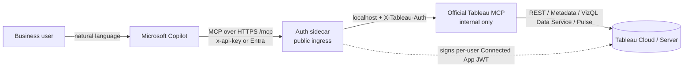

# Play 1 — Tableau MCP on Microsoft (official image + auth sidecar)

A **Microsoft landing zone** that one-click-deploys the **official
[Tableau MCP server](https://github.com/tableau/tableau-mcp)** to Azure and adds the glue a
Microsoft tenant needs to use it from **Copilot Studio / M365 Copilot / Azure AI Foundry**:

- **`x-api-key` front door** for Copilot Studio custom connectors (the official server speaks
  OAuth 2.1 by default; the sidecar bridges the simple-header world).
- **Entra → Tableau identity passthrough** so **Tableau row-level security applies per
  signed-in M365 user** (the hero capability), with graceful fall-back to a shared service
  account when you don't need per-user RLS.
- **Azure-native hygiene:** optional Key Vault + managed identity for secrets, optional Entra
  "Easy Auth" front door, Log Analytics, scale-to-zero.

We **wrap, not fork.** The official image (`ghcr.io/tableau/tableau-mcp`) runs unmodified, so
you inherit Tableau's ongoing updates and its full, supported tool set (datasources, VizQL
Data Service queries, workbooks, views, Pulse, content search — ~20 tools).



Both containers run in **one** Azure Container App. Only the sidecar is exposed; the official
server listens on localhost, so the sidecar is the complete auth boundary.

---

## One-click deploy (recommended for customers)

[](https://portal.azure.com/#create/Microsoft.Template/uri/https%3A%2F%2Fraw.githubusercontent.com%2FYarbrdab000%2FTableau-Fabric-AI-Bridge%2Fmain%2FPlay1%2Fdeploy%2Fazure%2Fazuredeploy.json)

Deploys to **Azure Container Apps** with HTTPS and scale-to-zero. You fill in a short form and
click **Create** — no Docker, no command line. Full walkthrough:
**[docs/customer-setup-guide.md](docs/customer-setup-guide.md)**.

> The button pulls two public images: the **official** `ghcr.io/tableau/tableau-mcp` and our
> **sidecar** image. The vendor publishes the sidecar once via
> `.github/workflows/build-sidecar-image.yml` and makes its GHCR package public. Customers then
> only ever click the button.

After deployment you get an **MCP endpoint** like
`https://tableau-mcp.<region>.azurecontainerapps.io/mcp` to register in Copilot Studio (see
[deploy/copilot-studio/](deploy/copilot-studio/)).

---

## Identity modes

| `identityMode`     | What each agent user sees | Per-user RLS | Requirements |
|--------------------|---------------------------|--------------|--------------|
| `service_account` (default) | Everything the one configured Tableau account can see | No | Works in any tenant; no Entra wiring needed |
| `passthrough`      | Only the rows *their own* Tableau user is allowed | **Yes** | Easy Auth (or APIM) in front + UPN→Tableau mapping |

`passthrough` maps the caller's Entra UPN to a Tableau username, signs a Connected App
(Direct Trust) JWT as that user, and injects `X-Tableau-Auth` into the official server. If a
caller can't be mapped, the request is **denied** (fail-closed) — it never silently falls back
to the privileged service account. See the sidecar's
[README](sidecar/README.md) and [docs/customer-setup-guide.md](docs/customer-setup-guide.md).

---

## Run locally (development / evaluation)

A docker-compose harness runs the **real** official image behind the sidecar:

```bash
cd Play1/deploy/local
cp .env.example .env          # fill in your Tableau Connected App values
docker compose up --build
curl -s localhost:9000/healthz
# MCP over HTTP at  http://localhost:9000/mcp   (header  x-api-key: $SIDECAR_API_KEY)
```

Sidecar unit/integration tests (no Docker needed):

```bash
cd Play1/sidecar
python -m venv .venv && . .venv/Scripts/activate    # or bin/activate on *nix
pip install -r requirements.txt pytest
python -m pytest tests -q
```

---

## Key deployment parameters

Full list + descriptions are in [`deploy/azure/main.bicep`](deploy/azure/main.bicep).

| Parameter | Purpose |
|-----------|---------|
| `tableauServer` / `tableauSite` | Tableau pod URL + site content URL. |
| `connectedAppClientId` / `connectedAppSecretId` / `connectedAppSecretValue` | Tableau Connected App (Direct Trust). |
| `serviceAccountUsername` | Tableau user the service account acts as (required by the official server at startup; the identity used in `service_account` mode). |
| `allowApiKey` / `sidecarApiKey` | Enable + set the shared `x-api-key` for Copilot Studio. |
| `identityMode` | `service_account` (default) or `passthrough`. |
| `upnMappingMode` (+ `upnDomainFrom`/`upnDomainTo`) | How Entra UPNs map to Tableau usernames (`direct` / `transform` / `explicit`). |
| `enableEasyAuth` (+ `entraClientId`, `entraTenantId`) | Turn on the Microsoft Entra front door. |
| `useKeyVault` | Store secrets in Key Vault via managed identity instead of plain Container App secrets. |
| `includeTools` / `maxResultLimits` | Tool curation (default `datasource,content-exploration` + `query-datasource:100`). |
| `tableauMcpImage` / `sidecarImage` | Pinned image references (pin the official image by digest for production). |

---

## Security

- **Caller auth:** `x-api-key` (treat as a secret; rotate via the `sidecar-api-key` secret) and/or
  **Microsoft Entra Easy Auth**. With api-key enabled, Easy Auth runs in `AllowAnonymous` so the
  sidecar enforces the key; without it, Easy Auth returns 401 at the platform edge.
- **No public official server:** ingress targets only the sidecar; the official container is
  unreachable from the internet (`DANGEROUSLY_DISABLE_OAUTH=true` is therefore safe).
- **Header spoofing:** the sidecar strips all client-supplied identity headers
  (`X-Tableau-Auth`, `X-MS-CLIENT-PRINCIPAL*`, …) before adding its own; it trusts Easy Auth's
  principal header only when `TRUST_EASY_AUTH` is on.
- **Per-user RLS (passthrough):** fail-closed on unresolved identity; per-user Tableau session
  tokens are cached in memory only, keyed by the full identity tuple, and never logged.
- **Secrets:** plain Container App secrets by default; opt into Key Vault + managed identity
  with `useKeyVault=true`.
- **Least privilege:** scope the Connected App to `tableau:content:read`,
  `tableau:viz_data_service:read` (+ `tableau:insights:read` if you expose Pulse). In
  `service_account` mode, use a least-privilege Tableau user — a Site Admin bypasses RLS.

---

## What's here

| Path | Purpose |
|------|---------|
| `deploy/azure/` | Bicep landing zone (`main.bicep`), compiled `azuredeploy.json`, params, `deploy.ps1`. |
| `deploy/local/` | docker-compose harness (official image + sidecar) for local runs. |
| `deploy/copilot-studio/` | Custom-connector swagger + wiring guide for Copilot Studio. |
| `sidecar/` | The auth sidecar (Starlette reverse proxy) + tests + Dockerfile. |
| `docs/customer-setup-guide.md` | End-to-end customer walkthrough. |
| `archive/` | The retired custom Python MCP fork (`server.py`), kept for reference only. |
