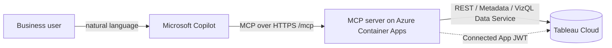

# Tableau-Fabric-AI-Bridge — MCP Server

A [Model Context Protocol](https://modelcontextprotocol.io) server that lets an AI agent
— **Microsoft Copilot Studio / M365 Copilot**, GitHub Copilot, Claude Desktop, etc. —
**inventory and query published Tableau datasources in natural language**.

It wraps the repo's live-tested Tableau client (REST + Metadata API + VizQL Data Service)
as three MCP tools:

| Tool | What it does |
|------|--------------|
| `list_datasources` | Lists published datasources on the site (name, LUID, project). |
| `get_datasource_schema` | Field-level schema — captions, data types, roles, folders, calculated-field formulas — so the agent learns exact field names before querying. |
| `query_datasource` | Runs a structured VizQL Data Service query (aggregations, filters, sorting, top-N) and returns rows. |

Read-only: it never modifies Tableau. It keeps one warm sign-in per worker process
(refreshed on a short TTL or on an auth failure) and signs out on shutdown.

---

## One-click deploy (recommended for customers)

[](https://portal.azure.com/#create/Microsoft.Template/uri/https%3A%2F%2Fraw.githubusercontent.com%2FYarbrdab000%2FTableau-Fabric-AI-Bridge%2Fmain%2Fmcp-server%2Fdeploy%2Fazure%2Fazuredeploy.json)

This deploys the server to **Azure Container Apps** with HTTPS, scale-to-zero (near-zero
idle cost), and your Tableau credentials stored as secrets. You fill in a short form and
click **Create** — no Docker, no command line. Full walkthrough:
**[docs/customer-setup-guide.md](docs/customer-setup-guide.md)**.

> The button pulls a prebuilt public container image. The **vendor** publishes that image
> once via the included GitHub Action (`.github/workflows/build-mcp-image.yml`) and makes
> the GHCR package public. Customers then only ever click the button.

After deployment you get an **MCP endpoint** like
`https://tableau-mcp.<region>.azurecontainerapps.io/mcp` to register in Copilot Studio.

---

## Run locally (for development / evaluation)

No hosting required — great for trying it in GitHub Copilot, VS Code, or Claude Desktop.

```bash
cd mcp-server
python -m pip install -r requirements.txt
cp .env.example .env        # then edit: set TABLEAU_AUTH=pat and your TABLEAU_PAT_* values

# stdio transport (default) — point your MCP client at: python mcp-server/server.py
MCP_TRANSPORT=stdio python server.py
```

Example MCP client config (GitHub Copilot / VS Code / Claude Desktop):

```json
{
  "mcpServers": {
    "tableau": {
      "command": "python",
      "args": ["C:/path/to/mcp-server/server.py"],
      "env": {
        "TABLEAU_SERVER": "https://10ay.online.tableau.com",
        "TABLEAU_SITE": "your-site",
        "TABLEAU_AUTH": "pat",
        "TABLEAU_PAT_NAME": "your-pat-name",
        "TABLEAU_PAT_VALUE": "your-pat-secret"
      }
    }
  }
}
```

To test the **HTTP** transport locally:

```bash
MCP_TRANSPORT=http PORT=8000 MCP_API_KEY=dev-secret python server.py
# health: GET http://localhost:8000/healthz
# MCP:    POST http://localhost:8000/mcp   (Authorization: Bearer dev-secret)
```

---

## Configuration (environment variables)

| Variable | Purpose |
|----------|---------|
| `MCP_TRANSPORT` | `stdio` (local) or `http` (hosted). |
| `PORT` | HTTP listen port (default 8000). |
| `MCP_API_KEY` | If set (http), callers must send `Authorization: Bearer <key>` or `x-api-key`. |
| `TABLEAU_SERVER` | Tableau pod/server URL, e.g. `https://10ay.online.tableau.com`. |
| `TABLEAU_SITE` | Site content URL (slug). Empty = Default site. |
| `TABLEAU_AUTH` | `jwt` (Connected App, recommended for hosting) or `pat`. |
| `TABLEAU_CONNECTED_APP_CLIENT_ID` / `_SECRET_ID` / `_SECRET_VALUE` | Connected App (Direct Trust) credentials. |
| `TABLEAU_JWT_USERNAME` | Tableau user the server acts as (service account — see Security). |
| `TABLEAU_PAT_NAME` / `TABLEAU_PAT_VALUE` | Personal Access Token (for `TABLEAU_AUTH=pat`). |
| `MCP_MAX_ROW_LIMIT` | Server-side cap on rows per query (default 1000). Requests above this, or `row_limit<=0`, are clamped. |
| `MCP_ALLOW_DISAGGREGATE` | `true` to permit row-level (disaggregated) extraction. Default `false` (aggregates only). |
| `TABLEAU_SESSION_TTL` | Seconds to reuse a Tableau sign-in before refreshing (default 540). |

---

## Security

- **Transport:** HTTPS only when hosted (Container Apps enforces TLS).
- **API key (required for the one-click deploy):** set `MCP_API_KEY` so only your Copilot
  connector can call the endpoint. In Copilot Studio, use the **`x-api-key` header** with
  the key value (or `Authorization: Bearer <key>`).
- **Service-account access model:** the server queries Tableau as the single
  `TABLEAU_JWT_USERNAME` you configure — it does **not** map individual Copilot users to
  Tableau identities. Results reflect that one account's permissions and row-level
  security. **Use a least-privilege Tableau user/group** scoped to only the datasources
  this agent should expose. A Site Admin (which bypasses RLS) is fine for a demo but is a
  poor production default. For different audiences, deploy separate instances with
  different service accounts.
- **Result guardrails:** `MCP_MAX_ROW_LIMIT` caps response size and `disaggregate` is
  disabled unless `MCP_ALLOW_DISAGGREGATE=true`, reducing data-exfiltration/timeout risk.
- **Microsoft Entra (recommended for production):** enable
  [built-in authentication](https://learn.microsoft.com/azure/container-apps/authentication)
  on the Container App to require Entra sign-in in front of the API key. See the setup guide.
- **Least privilege:** scope the Tableau Connected App to `tableau:content:read` and
  `tableau:viz_data_service:read` only.

### Row-level security (RLS) & per-user identity passthrough

**This repo ships with a single service-account model** — every Copilot user's question is
answered as the one `TABLEAU_JWT_USERNAME` you configure, so Tableau row-level security is
**not** applied per end user (and is bypassed entirely if that account is a Site/Server
Admin). This is intentional for a simple, low-friction v1.

To make the deployment **respect RLS per end user**, the server must impersonate the calling
user by setting the Connected App JWT `sub` to *their* Tableau username (the
`build_connected_app_jwt(..., username=...)` primitive already supports this). For that to
work end-to-end, the following must be in place:

**Tableau configuration**
- **Define RLS on the datasource(s).** Use user filters / data-source filters with
  `USERNAME()` / `USERMEMBEROF()`, or Tableau's centralized row-level security with
  entitlement tables. Identity alone restricts nothing if no RLS policy exists.
- **Provision the end users onto the Tableau site**, ideally via **SCIM** from your identity
  provider (e.g. Microsoft Entra). SCIM keeps the user set in sync and — crucially — keeps
  Tableau usernames aligned with the Entra identity (UPN/email), so `sub = <Entra UPN>`
  matches a real Tableau user with no hand-maintained mapping table.
- **Configure the Connected App for impersonation** and ensure impersonated users are
  licensed. The impersonated user must **not** be a Site/Server Admin (admins see all rows).
- Keep SSO/identity settings consistent so the Tableau username equals the identity asserted
  by your IdP (SCIM handles this when configured).

**Platform / server configuration (not included in this repo's v1)**
- **Identity passthrough** from Copilot Studio / Azure AI Foundry: configure the MCP tool's
  auth so the signed-in user's **Entra token** is forwarded to the server (OAuth
  on-behalf-of), instead of (or in addition to) the shared `x-api-key`.
- **Token validation on the server:** validate the incoming Entra JWT (signature via JWKS,
  audience, issuer, expiry), extract the `upn`/`email`, and use it as the Tableau `sub` —
  **never** accept the username as a tool argument (spoofable).
- **Per-user sessions:** cache Tableau sign-ins keyed by user (mind VDS per-user rate limits),
  and **fail closed** — reject requests without a verified identity rather than falling back
  to the service account.

**Summary:** with **SCIM (Entra↔Tableau) + identity passthrough + RLS defined on the
datasource**, the solution enforces row-level security per user. Without those, it operates
as a shared service account and all users see the same data.

---

## Architecture



The same `server.py` runs locally over stdio for development and over Streamable HTTP when
hosted, reusing the identical, live-tested Tableau client in
`.github/skills/tableau-datasource-profiler/scripts/`.
